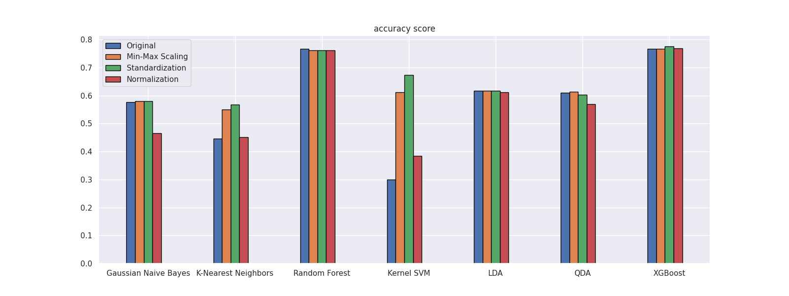
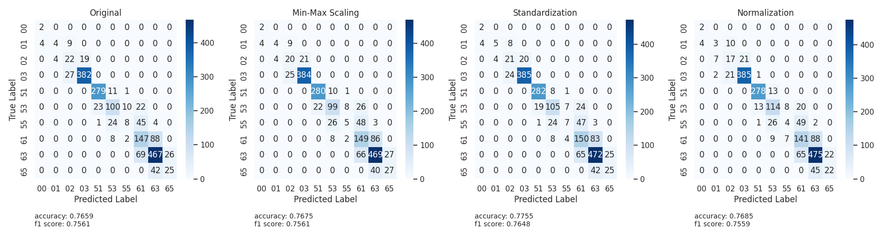
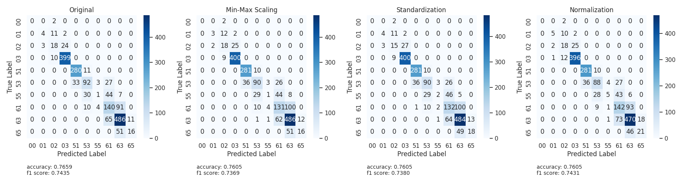

# Project Title
???

## Description

Phân loại bài toán: Classification

Dữ liệu:
- nguồn open-meteo.com
- dữ liệu thời tiết của TP.HCM từ năm 2000 đến hết tháng 8 năm 2025

Program đang dự đoán WMO code dựa trên các thông số thời tiết.

Về lý thuyết, WMO code là mã được đánh bởi chuyên viên.

WMO code thực tế có nhiều dạng khác nhau nhưng trên tập dữ liệu này chỉ có 10 loại.

## Getting Started

### Step 1

install requirements
download dataset nếu không thấy file data

### Step 2

chạy preprocessing.ipynb từng bước một, hiệu chỉnh nếu cần thiết

### Step 3

chạy file main_analysis.ipynb

## Kết quả

2 thuật toán tốt nhất lần lượt là XGBoost và Random Forest

